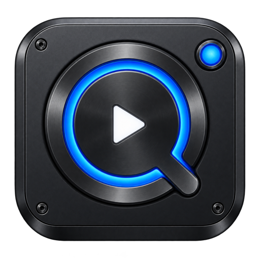

# QDeck Remote



Consola remota bidireccional para operar QLab 5 desde una Steam Deck. Usa OSC 1.1 sobre TCP, descubre los workspaces abiertos, muestra listas, playhead y cues activos, y aprovecha Steam Input sin instalar un puente en la Mac.

## Funciones

- Lista completa de cues con color, tipo, estado activo y playhead.
- GO, preview, pausa/reanudación y stop por cue.
- Pause, resume, stop, reset y panic globales.
- Monitor de cues activos y navegación por secuencias.
- Ajustes relativos de volumen (±1/±3 dB) para todos los cues activos o solo el cue enfocado, sin destruir su balance.
- Reconexión automática, passcode de QLab y selección de workspace.
- Confirmación visual y háptica cuando QLab acepta cada comando.
- Modo Show bloqueado para proteger configuración y Reset.
- Tema claro/oscuro manual y persistente, independiente del tema de SteamOS.
- Controles táctiles, teclado y gamepad; interfaz optimizada para 1280 × 800.
- Acciones destructivas protegidas mediante pulsación de 1.2 segundos.
- Modo demostración para conocer y probar la interfaz sin una Mac.

## Preparar QLab

1. Conecta la Mac y la Steam Deck a la misma red. Para shows, usa un router dedicado de 5 GHz y conecta la Mac por Ethernet si es posible.
2. Abre el workspace en QLab 5.
3. Ve a **Workspace Settings → Network → OSC Access**.
4. En un passcode, activa al menos **View** y **Control**. La aplicación no necesita permiso **Edit**.
5. Conserva el puerto OSC `53000` o introduce en QDeck el puerto que hayas configurado.
6. Permite conexiones entrantes para QLab en el firewall de macOS.

## Ejecutar durante el desarrollo

Requiere Node.js 20 o posterior.

```bash
npm install
npm start
```

Al primer inicio aparecerá la configuración. Introduce la IP local de la Mac, el puerto y el passcode. Puedes activar **Modo demostración** para probar todo sin QLab.

## Instalar en Steam Deck

En Desktop Mode:

```bash
npm install
npm run dist:linux
```

El AppImage se genera en `dist/`. Dale permiso de ejecución y agrégalo a Steam como producto externo. En propiedades, añade `--fullscreen` a los argumentos de lanzamiento si quieres forzar pantalla completa.

## Compilar para macOS

```bash
npm install
npm run dist:mac
```

La aplicación `.app` se genera dentro de `dist/mac/`. Es una compilación local sin firma de Apple; macOS puede pedir confirmación la primera vez que se abre.

### Steam Input

Selecciona una plantilla **Gamepad con trackpad como mouse**. Los controles estándar se detectan directamente:

| Control | Acción |
|---|---|
| A / gatillo derecho mediante Steam Input | GO; en Cue Cart, lanzar el cue seleccionado |
| B | Detener cue enfocado |
| X | Pausar/reanudar cue enfocado |
| Y | Preview sin avanzar playhead |
| Cruceta arriba/abajo | Playhead anterior/siguiente |
| Cruceta izquierda/derecha | Vista anterior/siguiente |
| L1/R1 | Cue List anterior/siguiente |
| L2/R2 | Cue Cart anterior/siguiente, separado de las listas |
| View + L1/R1 | Secuencia anterior/siguiente |
| Stick izquierdo | Navegar la lista |
| Click L3 | Llevar playhead al cue enfocado |
| Stick derecho izquierda/derecha | Cambiar de vista |
| Stick derecho arriba/abajo | Activar panel Cue Lists/Cue Carts |
| Click R3 | Abrir monitor de activos |
| L3 + R3, mantener 1.2 s | PANIC protegido |
| View | Vista de control global |
| View + A/X/B | Reanudar/pausar/detener todo |
| View + Y | Alternar tema claro/oscuro |
| View + cruceta arriba/abajo | Subir/bajar 1 dB todos los cues activos |
| Menu | Configuración |
| Trackpad derecho/táctil | Puntero y control directo |

Los botones Steam y Quick Access están reservados por SteamOS. Para aprovechar L4, L5, R4 y R5, asígnalos en Steam Input a estas teclas:

- L4 → `[`: cue anterior
- R4 → `]`: cue siguiente
- L5 → `\`: alternar panel Cue Lists/Cue Carts
- R5 → `P`: volver visualmente al cue del playhead

El trackpad derecho puede configurarse como mouse con rueda: QDeck desplaza el panel activo incluso cuando el puntero queda fuera de la lista.

## Verificación

```bash
npm test
npm run check
```

La comunicación utiliza el framing double-END SLIP exigido por OSC 1.1/QLab. TCP evita truncar respuestas grandes como las listas de cues.

## Seguridad operativa

Haz una prueba completa antes del evento y conserva acceso físico a la Mac como respaldo. `PANIC` y `Reset workspace` requieren mantener el control; `GO` responde inmediatamente, como en una consola de show.
